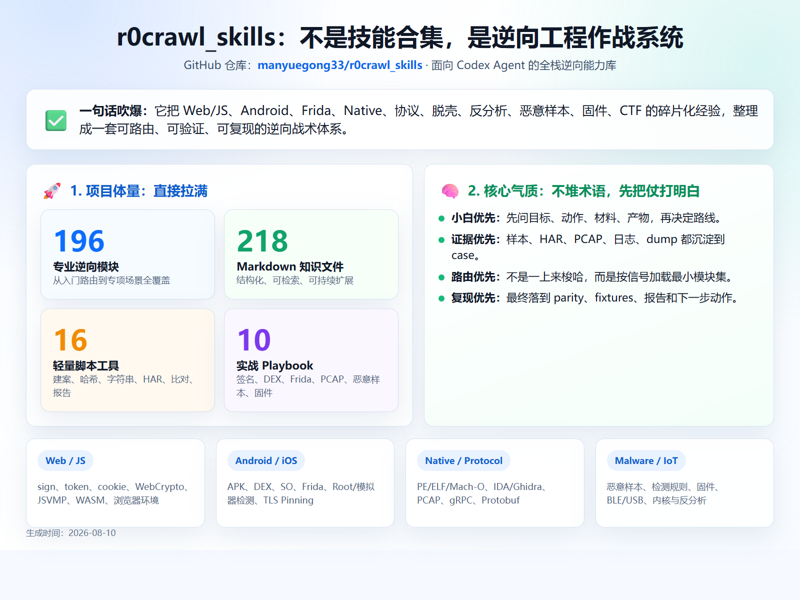
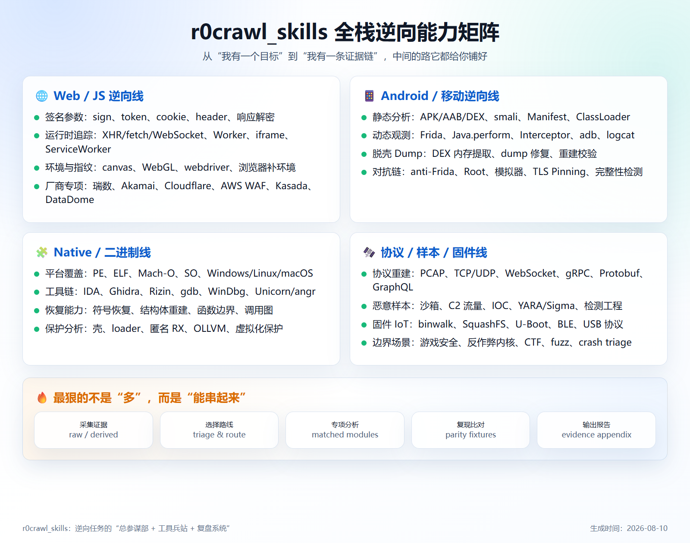
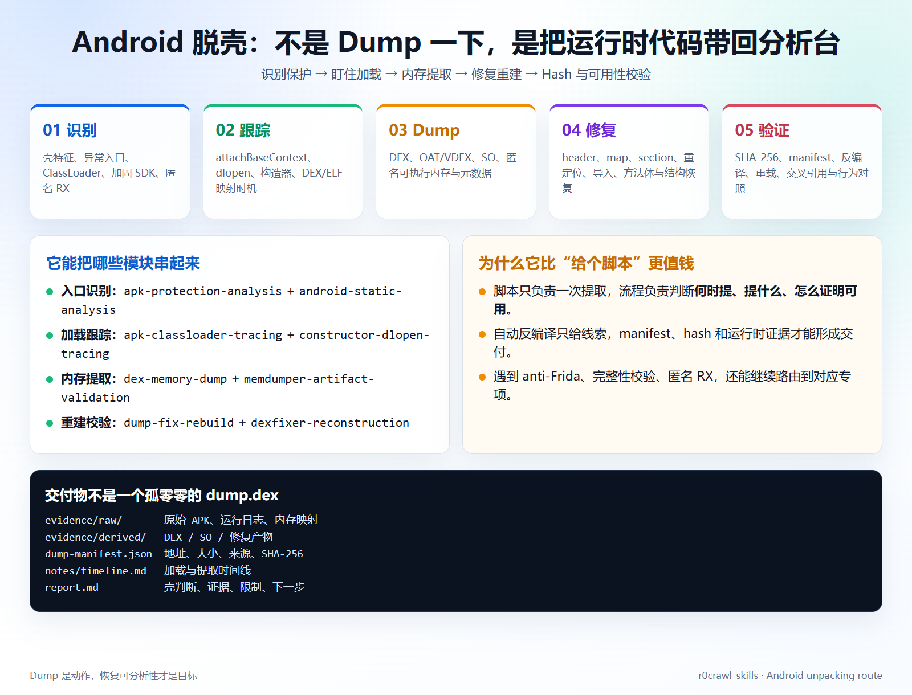
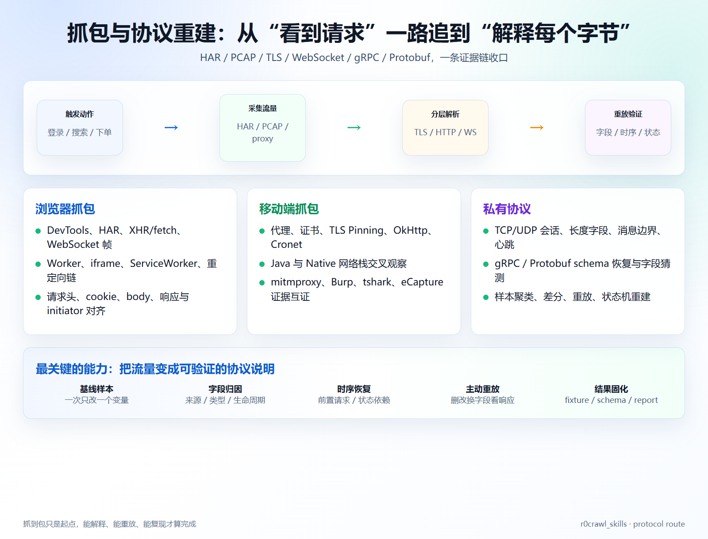
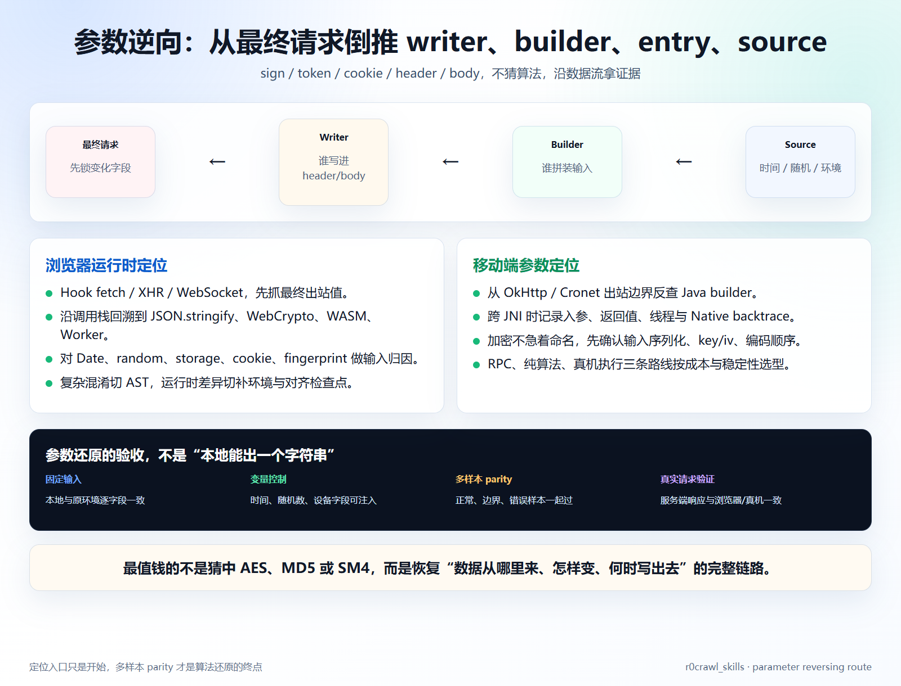
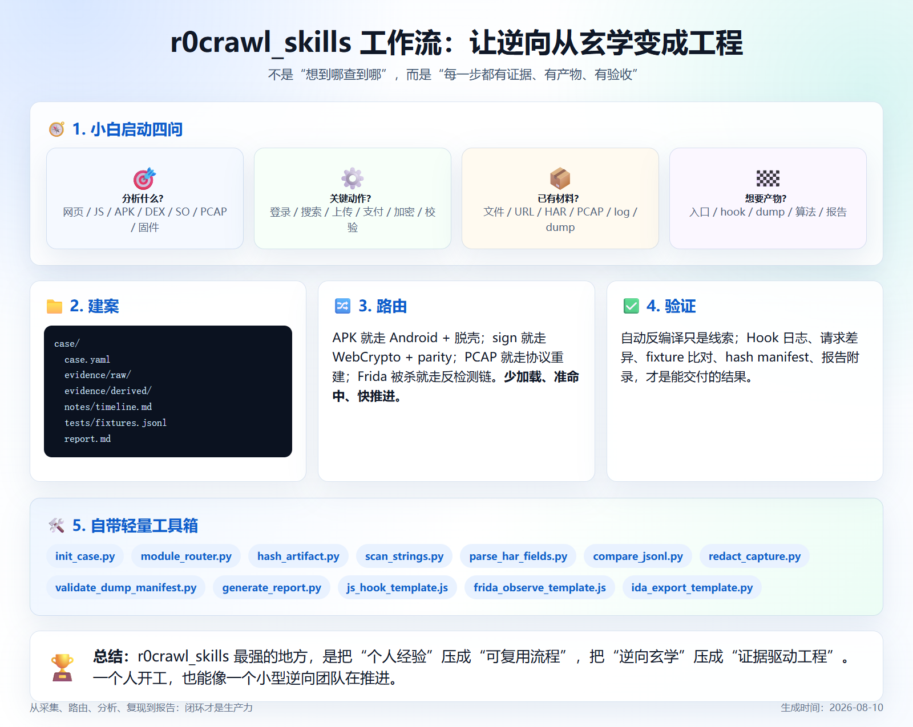

# [原创] 我把散装逆向经验压成了一套 Agent 作战系统：r0crawl_skills 全面介绍



## 先说结论

逆向最浪费时间的，往往不是某一个 API 不会用，而是面对目标时不知道先看什么、证据放哪里、下一步该切哪条线。

`r0crawl_skills` 做的事情，就是把这些判断和重复劳动整理成 Codex Agent 可以直接调度的工程流程：先确认目标，再收集证据，命中专项模块，最后用样本比对和报告收口。

它不是把 Markdown 丢进 `skills/` 目录凑数量，也不是“装了以后自动破解一切”。它更像一个逆向项目的总参谋部：负责拆任务、选路线、串工具、留证据、做复现。

| 维度 | 零散资料 | r0crawl_skills |
|---|---|---|
| 上手 | 术语很多，容易从错误方向开始 | 小白模式先问目标、动作、材料、产物 |
| 规模 | 几篇文章、几个临时脚本 | 196 个专项模块、219 个 Markdown 文件 |
| 脱壳 | “给你一个 dump 命令” | 保护识别、加载跟踪、内存提取、修复、重建、校验 |
| 抓包 | 看到请求就结束 | HAR/PCAP 采集、字段归因、时序恢复、主动重放 |
| 参数逆向 | 猜 AES、MD5、签名函数 | 从最终请求倒推 writer、builder、entry、source |
| 结果 | 分析结论停在聊天记录里 | case、hash、fixture、report、限制和下一步 |

一句话：把“我感觉这里是加密”推进到“我有证据证明输入、变换、输出和复现结果”。

## 它到底覆盖什么



### Web / JavaScript

sign、token、cookie、header、响应解密、WebCrypto、WASM、JSVMP/VMP、AST 解混淆、浏览器环境、指纹、Worker、iframe、ServiceWorker、WebSocket、GraphQL，以及瑞数、Akamai、Cloudflare、AWS WAF、DataDome、Kasada、PerimeterX 等专项路线都已经拆开。

抖音 `a_bogus/x-bogus`、小红书 `x-s/x-t`、淘宝 `H5ST`、美团 `mtgsig`、知乎 `zse`、雪球 `acw` 这类参数任务，不再需要每次从“抓哪个函数”开始重新设计。

### Android / iOS

APK/AAB/DEX、smali、Manifest、ClassLoader、JNI、SO、Frida、adb、logcat、TLS Pinning、OkHttp、Cronet、Root/模拟器检测、anti-Frida、DEX dump、dump 修复和 native 加载链，按静态、动态、运行时三层组织。

### Native / 协议 / 样本

PE、ELF、Mach-O、IDA、Ghidra、Rizin、gdb、WinDbg、Unicorn/angr；PCAP、TCP/UDP、WebSocket、gRPC、Protobuf；恶意样本、C2、IOC、YARA/Sigma；固件、U-Boot、SquashFS、BLE/USB；fuzz、crash、CTF、IL2CPP、反作弊内核，均有对应模块和参考资料。

真正离谱的不是覆盖面大，而是这些线能接起来：流量发现参数入口，参数入口再落到 Java/Native，运行时证据又能反过来校验协议重放。

## 专项一：脱壳不是“按一下 Dump”



Android 脱壳最容易被低估。一个能被 JADX 打开的 APK，不代表关键代码就在 APK 里；一个成功导出的 `classes.dex`，也不代表它能被重新加载、反编译和验证。

`r0crawl_skills` 把这条线拆成五步：

1. **识别保护面**：看异常入口、加固 SDK、ClassLoader、so 加载、匿名 RX、完整性检查和运行时解密迹象。
2. **跟踪加载时机**：围绕 `attachBaseContext`、`dlopen`、构造器、DEX 映射、类解析建立时间线。
3. **提取运行时代码**：根据内存映射和加载证据选择 DEX、OAT/VDEX、SO 或匿名可执行区作为产物。
4. **修复与重建**：恢复 header、map、section、方法体、重定位、导入和必要的元数据，让产物重新具备分析条件。
5. **验收交付**：记录来源、地址、大小、SHA-256、工具版本，跑反编译、重载、交叉引用和行为对照。

对应模块包括 `apk-protection-analysis`、`apk-classloader-tracing`、`constructor-dlopen-tracing`、`dex-memory-dump`、`dump-fix-rebuild`、`dexfixer-reconstruction` 和 `memdumper-artifact-validation`。

所以最终交付的不是“我 dump 出来了”，而是一组能解释、能复查、能继续分析的证据：

```text
evidence/raw/       原始 APK、运行日志、maps、内存片段
evidence/derived/   DEX / SO / 修复产物
dump-manifest.json  地址、大小、来源、SHA-256
notes/timeline.md   加载与提取时间线
report.md           壳判断、证据、限制、下一步
```

## 专项二：抓包要追到协议语义



抓到一条 HTTP 请求只是起点。真正有价值的问题是：哪些字段由用户动作产生，哪些来自缓存，哪些由设备环境生成，前置请求如何影响当前状态，响应里的字段下一步又被谁消费。

浏览器路线会关注 DevTools/HAR、XHR/fetch、WebSocket 帧、Worker、iframe、ServiceWorker、重定向和 initiator；移动端路线会把代理、证书、TLS Pinning、OkHttp、Cronet、Java 与 Native 网络栈交叉起来；私有协议路线则继续处理 TCP/UDP 会话、长度字段、消息边界、心跳、gRPC/Protobuf schema 和状态机。

推荐的证据顺序是：

1. 先保存原始 HAR/PCAP，不在原文件上直接改。
2. 用 `parse_har_fields.py` 展开 headers、query、body、response，建立字段清单。
3. 做最小差分，一次只改一个输入，观察请求、响应和时序变化。
4. 对敏感信息运行 `redact_capture.py`，再把脱敏后的材料放进 case。
5. 用 `compare_jsonl.py` 保存重放结果，最后把字段语义、状态依赖和限制写进报告。

这条线的结果不应该只是“接口能访问”，而应该是可读的协议说明和可复现的 fixture。

## 专项三：参数逆向从最终请求倒推



参数逆向最忌讳一上来猜算法。先把最终出站值锁住，再沿数据流反查：谁把值写进 header/body，谁拼装输入，哪些时间、随机数、设备字段和存储状态参与了计算。

### Web 侧

- Hook `fetch`、XHR、WebSocket，先记录最终请求和调用栈。
- 沿栈回溯到 `JSON.stringify`、WebCrypto、WASM、Worker 或自执行解码器。
- 对 Date、random、storage、cookie、fingerprint 做输入归因。
- 混淆严重时切 AST；结果漂移时切补环境和对齐检查点。

### 移动侧

- 从 OkHttp/Cronet 出站边界反查 Java builder。
- 跨 JNI 记录入参、返回值、线程、模块和 Native backtrace。
- 先确认序列化、key/iv、编码顺序，再给算法命名。
- 按成本和稳定性选择纯算法、RPC 或真机执行，不把路线争论变成拖延。

验收至少要有固定输入、变量控制、多样本 parity 和真实请求验证。本地能生成一个字符串不算完成；浏览器、真机和服务端行为一致，才算把参数链真正还原。

## 小白模式为什么重要



第一次接触逆向的人，最容易在工具之间来回跳：今天学 Frida，明天看 IDA，后天又去搜某个签名名词。`r0crawl_skills` 的入口先固定四件事：

1. 分析什么：网页、JavaScript、APK、DEX、SO、二进制、PCAP、固件还是样本？
2. 关键动作：登录、搜索、上传、支付、加密、校验还是网络交换？
3. 已有材料：URL、文件、HAR、PCAP、日志、截图、dump 还是只有描述？
4. 目标产物：行为解释、入口定位、Hook、dump、算法、复现请求还是报告？

回答完这四问，Agent 才选择最小模块集。APK 走 Android 与脱壳，sign/token 走 Web 签名、WebCrypto 与 parity，PCAP 走协议重建，Frida 被杀走 anti-Frida、Root/模拟器和完整性链。少加载、准命中、快推进。

## 自带工具箱：把重复劳动收走

仓库有 16 个轻量脚本，覆盖建案、采证、扫描、脱敏、比对和报告：

| 工具 | 用途 |
|---|---|
| `init_case.py` | 创建可复现 case 目录 |
| `hash_artifact.py` | 计算样本大小与 SHA-256 |
| `scan_strings.py` | 提取 ASCII / UTF-16 字符串 |
| `parse_har_fields.py` | 展开 HAR 字段与响应结构 |
| `compare_jsonl.py` | 比对 parity fixtures |
| `redact_capture.py` | 分享抓包前脱敏常见 secret |
| `validate_dump_manifest.py` | 校验 dump manifest 与 hash |
| `module_router.py` | 根据自然语言推荐模块 |
| `check_toolchain.py` | 检查本机可用工具链 |
| `generate_report.py` | 生成 case 文件清单报告 |
| `frida_observe_template.js` | 观察型 Frida 起步模板 |
| `js_hook_template.js` | fetch 观察 Hook 模板 |
| `ida_export_template.py` | IDAPython 导出模板 |

这些脚本不负责替你做判断，但会把最耗时间的机械动作先收掉，让注意力回到真正的证据和决策上。

## 10 套实战 Playbook

仓库还带了 10 套经过脱敏的样板路线：Web signature parity、Android DEX dump validation、Frida detection triage、JS Hook and WebCrypto、Native loader and anonymous RX、PCAP protocol reconstruction、Malware triage and detection、Firmware filesystem、Selective emulation、Beginner case report。

它们的价值不是“多十个例子”，而是告诉 Agent 一条成熟路线应该有哪些中间产物、验证点和失败恢复动作。照着样板开工，再把目标特有的证据填进去，远比从空白聊天记录开始靠谱。

## 安装与第一次启动

```powershell
Copy-Item -Recurse .\r0crawl_skills $env:USERPROFILE\.codex\skills\r0crawl_skills
```

然后在 Codex 中直接说：

```text
Use r0crawl_skills. 按小白模式 start，帮我分析这个 APK，目标是定位登录参数并验证复现。
```

也可以先跑工具：

```powershell
python scripts\init_case.py demo-signature
python scripts\module_router.py "Android 脱壳 抓包 参数逆向"
python scripts\check_toolchain.py
```

## 最后再吹一句

普通 AI 更像会回答问题的助手；接上 `r0crawl_skills` 后，Agent 多了一本作战手册、一只工具箱和一套复盘习惯。它不会替你凭空创造证据，但能把“找入口、做 Hook、拆流量、修 dump、跑 parity、写报告”这些工程动作持续推进下去。

逆向的上限从来不只是会多少工具，而是能不能把经验沉淀成下一次还能复用的系统。`r0crawl_skills` 正是在做这件事。

项目地址：<https://github.com/manyuegong33/r0crawl_skills>

> 仅使用于已获授权的样本、应用和测试环境。分享材料前请先脱敏，报告中保留证据来源、限制和复现条件。
